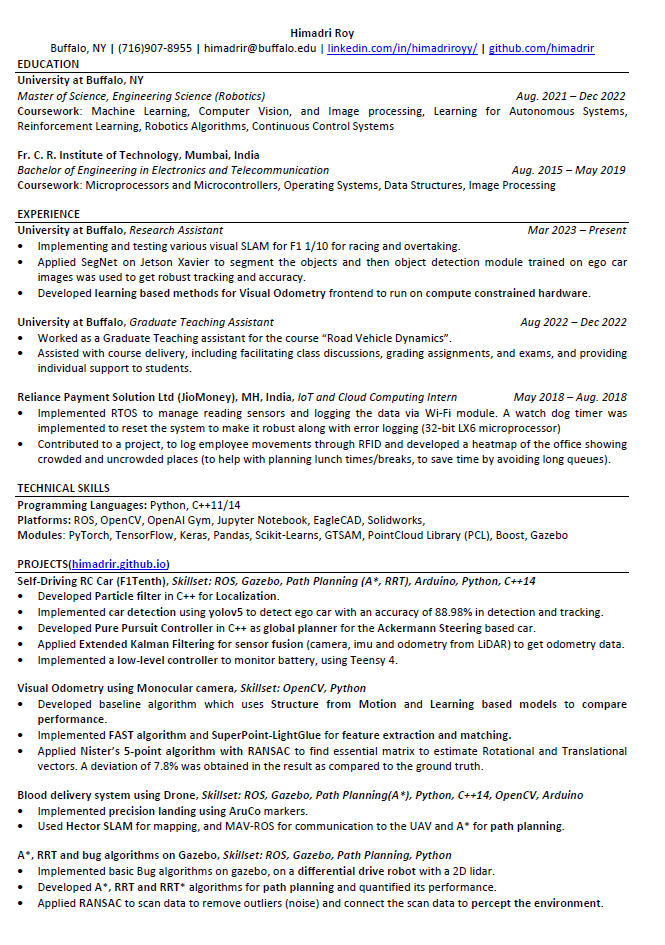

# About me #
I am Robotics Graduate student from University at Buffalo. My key interests lie in Perception, Path Planning and Machine Learning in Autonomous Systems. I also enjoy learning and reading about new tech, application of AI/ML in sports such as football(soccer) and Formula 1. As a hobby I like playing Counter Strike, watching F1(big RedBull fan) and making interesting side projects.

## Education ##
- **Masters of Science**, Engineering Science(Robotics), University at Buffalo
- **Bachelors of Engineering**, Electronics and Telecommunication, FCRIT (Navi Mumbai), India

## Skillset ##
Python, C++11/14, Pytorch, ROS, OpenCV, Keras

## Interests ##
Robotics Algorithms, Path Planning, SLAM, NLP, Deep Learning frameworks for Visual Odometry front-end.

## Projects ##

- [Autonomous racing car](https://github.com/himadrir/self-driving-car)
- [Lane segmentation using yolop](https://github.com/himadrir/yolop_lane_segmentation)
- [PoseNet++, CNN based pose regression](https://github.com/himadrir/posenet)
- [Visual Odometry using LightGlue and SuperPoint](https://github.com/himadrir/vo_lightglue)
- [A* Path Planning](https://github.com/himadrir/a_star_cpp)
- [American Sign Language Interpretation using LSTM](https://github.com/himadrir/sign-language-LSTM)
- [Automated blood delivery using UAVs](https://github.com/himadrir/uav-autonomous-navigation)
- [Reinforcement Learning on Google Research Football](https://github.com/himadrir/grf-test-algorithms)
- [Vision based obstacle avoiding robot using CNN and Jetson utils](https://github.com/himadrir/obstacle-avoidance-jetbot)

## Resume ##

<a href="assets/cv.pdf" target="_blank">PDF.</a>

## Contact ##
- email: himadrir@buffalo.edu
- twitter: himadrifpv

